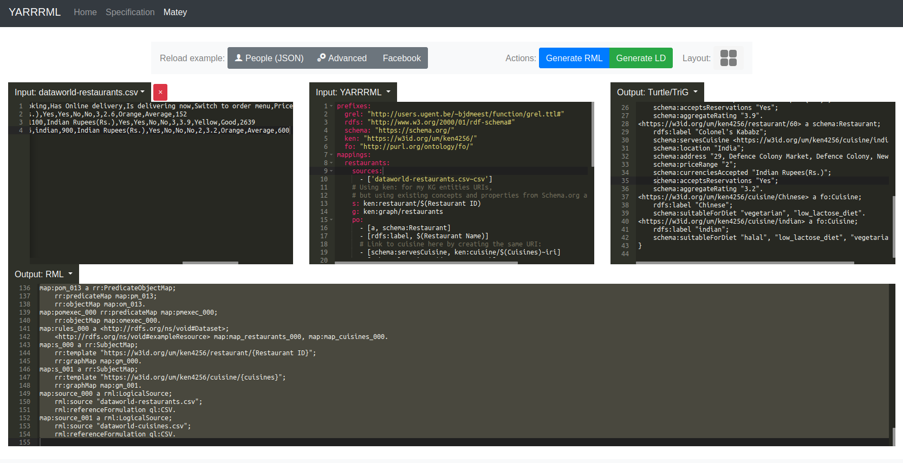

## Build a RDF Knowledge Graph from CSV files

A short tutorial to build a RDF Knowledge Graph about restaurants and cuisines from [2 CSV files](https://data.world/mgarfield/restaurants/) using YARRRML mappings.

1. **Go to https://rml.io/yarrrml/matey**

2. **Create 2 new datasources** for the [`dataworld-restaurants.csv`](/dataworld-restaurants.csv) and [`dataworld-cuisines.csv`](/dataworld-cuisines.csv) files
* [`dataworld-restaurants.csv`](/dataworld-restaurants.csv):

```
Restaurant ID,Restaurant Name,City,country name,Address,Locality,Locality Verbose,Longitude,Latitude,Cuisines,Average Cost for two,Currency,Has Table booking,Has Online delivery,Is delivering now,Switch to order menu,Price range,Aggregate rating,Rating color,Rating text,Votes
53,Amber,New Delhi,India,"N-19, Connaught Place, New Delhi",Connaught Place,"Connaught Place, New Delhi",77.220891,28.630197,indian,1800,Indian Rupees(Rs.),Yes,Yes,No,No,3,2.6,Orange,Average,152
55,Berco's,New Delhi,India,"G-2/43, Middle Circle, Connaught Place, New Delhi",Connaught Place,"Connaught Place, New Delhi",77.217298,28.632452,Chinese,1100,Indian Rupees(Rs.),Yes,Yes,No,No,3,3.9,Yellow,Good,2639
60,Colonel's Kababz,New Delhi,India,"29, Defence Colony Market, Defence Colony, New Delhi",Defence Colony,"Defence Colony, New Delhi",77.230591,28.574036,indian,900,Indian Rupees(Rs.),Yes,No,No,No,2,3.2,Orange,Average,600
```

* [`dataworld-cuisines.csv`](/dataworld-cuisines.csv):

```
cuisines,uses pork,mostly vegetarian,spicy,use lactose,id,diets
Chinese,yes,yes,no,no,chinese,vegetarian|low_lactose_diet
indian,no,no,no,no,indian,halal|low_lactose_diet|vegetarian
```

3. Copy/paste those [YARRRML mappings](/mappings.yarrr.yml) in the **input: YARRRML** box

```yaml
prefixes:
  grel: "http://users.ugent.be/~bjdmeest/function/grel.ttl#"
  rdfs: "http://www.w3.org/2000/01/rdf-schema#"
  schema: "https://schema.org/"
  ken: "https://w3id.org/um/ken4256/"
  fo: "http://purl.org/ontology/fo/"
mappings:
  restaurants:
    sources:
      - ['dataworld-restaurants.csv~csv']
    s: ken:restaurant/$(Restaurant ID)
    g: ken:graph/restaurants
    po:
      - [a, schema:Restaurant]
      - [rdfs:label, $(Restaurant Name)]
      # Link to cuisine here by creating the same URI:
      - [schema:servesCuisine, ken:cuisine/$(Cuisines)~iri]
      - [schema:location, $(country name)]
      - [schema:address, $(Address)]
      - [schema:priceRange, $(Price range)]
      - [schema:currenciesAccepted, $(Currency)]
      - [schema:acceptsReservations, $(Has Table booking)]
      - [schema:aggregateRating, $(Aggregate rating)]
  cuisines:
    sources:
      - ['dataworld-cuisines.csv~csv']
    s: ken:cuisine/$(cuisines)
    g: ken:graph/restaurants
    po:
      - [a, fo:Cuisine]
      - [rdfs:label, $(cuisines)]
      # Use a function to split the diets cell using |
      - p: schema:suitableForDiet
        o:
          function: grel:string_split
          parameters:
          - [grel:p_string_sep, "\|"]
          - [grel:valueParameter, $(diets)]
```

4. Click on **Generate RML**, then **Generate LD** buttons. The conversion should take around 10s.



## Notes

We use the `ken:` prefix for the Knowledge Graph entities URIs (the restaurants and cuisine generated)

But we use existing concepts and properties from the [Schema.org vocabulary](https://schema.org) and the [Food Ontology](https://www.bbc.co.uk/ontologies/fo#terms_cuisine)